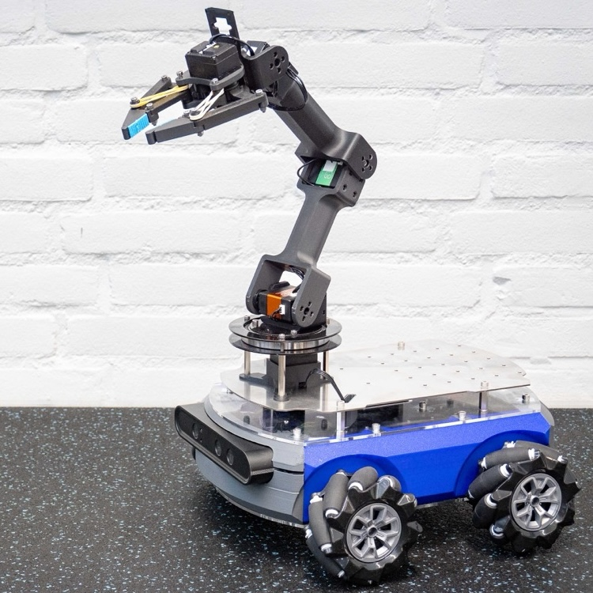
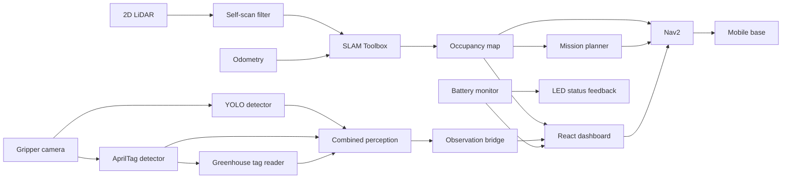
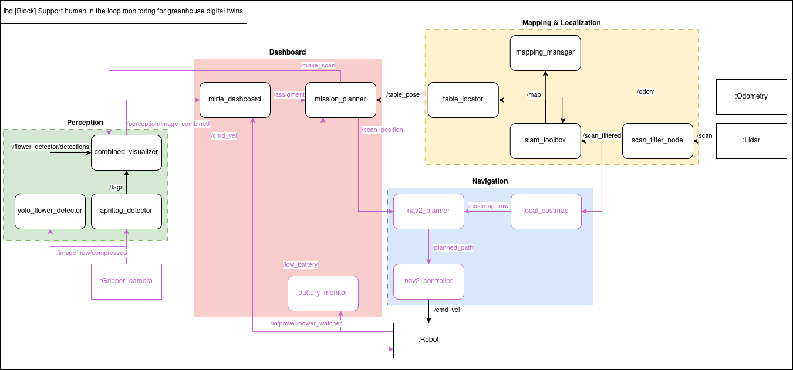
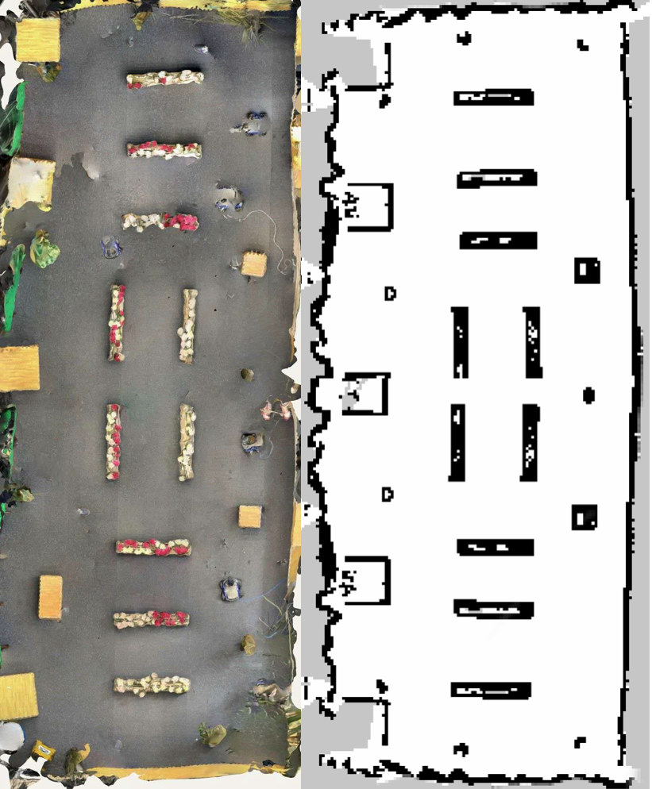
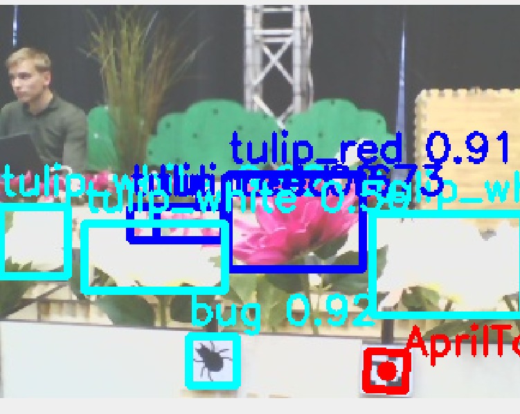
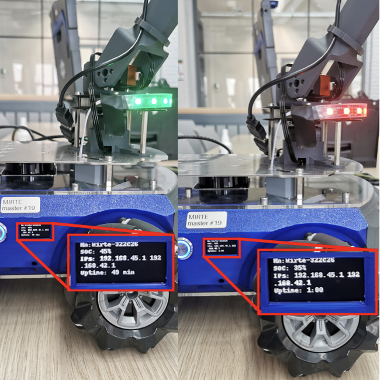
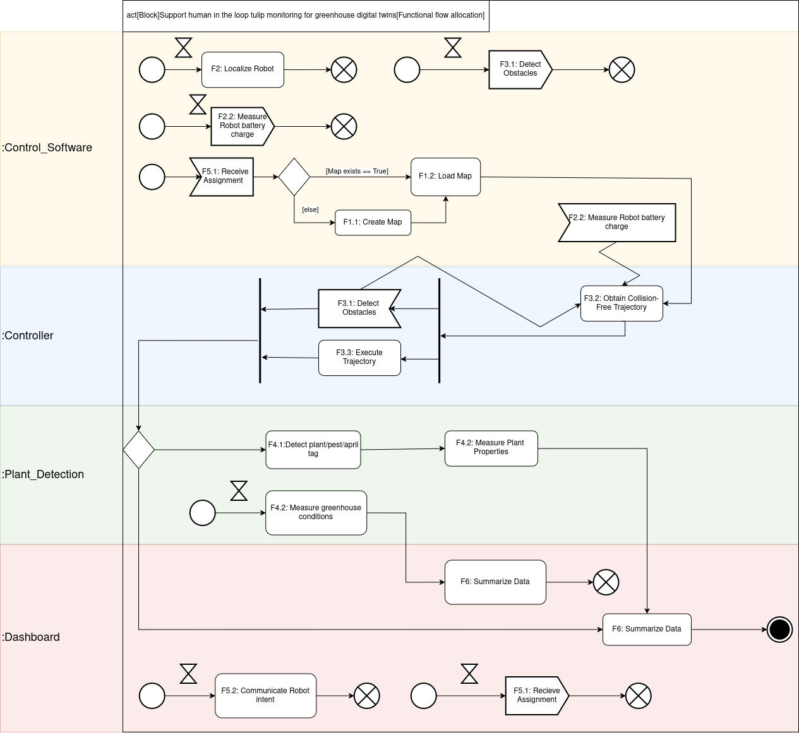
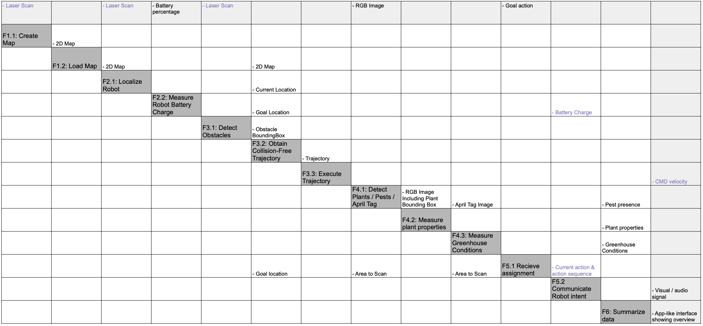

<p align="center">
  
</p>

<h1 align="center">Greenhouse Autonomy Stack</h1>

<p align="center">
  <strong>A ROS 2 autonomy, perception, and supervision stack for a mobile greenhouse robot—engineered from digital twin to physical deployment.</strong>
</p>

<p align="center">
  
  
  
  
  
</p>

<p align="center">
  <a href="#system-at-a-glance">Architecture</a> ·
  <a href="#engineering-highlights">Highlights</a> ·
  <a href="#results">Results</a> ·
  <a href="#reproduction-guide">Reproduction guide</a> ·
  <a href="#repository-layout">Repository layout</a>
</p>

---

## Mission

This repository contains the complete software stack developed by **Group 01** for the TU Delft **RO47007 Multidisciplinary Project**. The robot builds a greenhouse map, localizes itself, plans collision-free missions between plant rows, detects flowers and pests, associates measurements with AprilTags, and exposes its internal state through a browser-based operator dashboard.

The same ROS interfaces are used across Gazebo and the MIRTE Master robot, keeping the transition from simulation to hardware explicit and testable.

## Engineering highlights

| Capability | Implementation |
|---|---|
| **Digital twin** | Configurable greenhouse layout, generated Gazebo world, and virtual sensor tags |
| **Mapping** | Online asynchronous `slam_toolbox`, LiDAR self-filtering, map-health monitoring, and timestamped map + pose-graph persistence |
| **Localization** | Interchangeable AMCL and `slam_toolbox` localization workflows |
| **Navigation** | Nav2 global/local planning with simulation- and hardware-specific velocity remapping |
| **Mission autonomy** | Occupancy-grid table extraction, generated row scan poses, sequential Nav2 goals, and a custom ROS 2 scan action |
| **Perception** | YOLO flower/pest detection, AprilTag detection, flower-length estimation, and greenhouse sensor lookup |
| **Operator interface** | React dashboard with live occupancy map, robot pose, goal/initial-pose interaction, camera feeds, battery state, and arm commands |
| **Observability** | Saved image/JSON observations, ROS-to-HTTP dashboard bridge, robot status monitoring, and low-battery LED feedback |

## System at a glance



<p align="center">
  
  <br />
  <sub>ROS node-level architecture spanning perception, mapping/localization, navigation, mission planning, and supervision.</sub>
</p>

## End-to-end autonomy loop

1. **Model** the greenhouse and generate a matching Gazebo world.
2. **Map** the environment from LiDAR and odometry while filtering robot self-returns.
3. **Persist** both the occupancy map and serialized SLAM pose graph.
4. **Localize** with AMCL or `slam_toolbox` against the saved environment.
5. **Extract** table clusters from the occupancy grid and generate row-level scan poses.
6. **Navigate** through the mission with Nav2 and capture observations through a custom ROS 2 action.
7. **Interpret** camera data with YOLO, AprilTags, scale-aware flower measurements, and greenhouse tag readings.
8. **Supervise** the robot from the web dashboard with live map, perception, battery, and motion controls.

## Results

<table>
  <tr>
    <td width="52%" align="center">
      
      <br /><strong>Physical environment → occupancy grid</strong>
    </td>
    <td width="48%" align="center">
      
      <br /><strong>YOLO detections + AprilTag context</strong>
    </td>
  </tr>
</table>

<p align="center">
  
  <br />
  <sub>Human-readable robot feedback: state-of-charge telemetry drives both the onboard display and threshold-based LED status.</sub>
</p>

## Repository layout

```text
.
├── dashboard/                       # React operator UI + ROS launch integration
├── flower_detector/                 # YOLO, AprilTag fusion, measurement, snapshots
├── greenhouse_simulation/           # Layout config, world generator, Gazebo world
├── led_strip/                       # Battery monitoring and LED state feedback
├── maps/                            # Raw/filtered maps and serialized pose graphs
├── mdp_interfaces/                  # Custom Scan.action interface
├── mdp_localization/                # AMCL and SLAM Toolbox localization
├── mdp_mapping/                     # SLAM launch, scan filter, map manager
├── mdp_navigation/                  # Nav2 configuration
├── mirte_launch/                    # Simulation and physical-robot bringup
├── mission_planner/                 # Map-to-mission generation and execution
└── perception_dashboard_bridge/     # Latest-observation ROS/HTTP bridge
```

<details>
<summary><strong>Package responsibilities</strong></summary>

| Package | Responsibility |
|---|---|
| `greenhouse_simulation` | Defines the greenhouse layout and generates `greenhouse.world` |
| `mdp_mapping` | Launches Gazebo, SLAM, Nav2, RViz, scan filtering, and map persistence |
| `mdp_localization` | Provides AMCL and SLAM Toolbox localization configurations |
| `mdp_navigation` | Stores tuned Nav2 parameters for greenhouse navigation |
| `mirte_launch` | Selects the simulation or real-robot execution path |
| `mission_planner` | Detects table clusters, generates scan poses, navigates, and records observations |
| `mdp_interfaces` | Defines the custom action contract used for scanning |
| `flower_detector` | Runs the complete camera perception and measurement pipeline |
| `perception_dashboard_bridge` | Publishes the latest saved observation and serves its files over HTTP |
| `dashboard` | Presents maps, pose, battery, camera, observations, and operator controls |
| `led_strip` | Converts battery state into visible onboard feedback |

</details>

## Reproduction guide

The sections below preserve the project's original step-by-step workflows while making their working directories and execution paths explicit.

### 1. Set up the virtual greenhouse

<details open>
<summary><strong>Expand the complete environment-generation tutorial</strong></summary>

This project uses `mdp-greenhouse` to define the virtual greenhouse layout. The layout is stored in `greenhouse_simulation/greenhouse_setup/` and converted into a Gazebo world by a Python generator.

#### 1.1 Install dependencies

From the repository root:

```bash
cd greenhouse_simulation
python3 -m pip install --user -r requirements.txt
```

If the `mdp-greenhouse` command is not found, add the local Python binary directory to `PATH`:

```bash
echo 'export PATH="$HOME/.local/bin:$PATH"' >> ~/.bashrc
source ~/.bashrc
```

#### 1.2 Edit the greenhouse layout

From `greenhouse_simulation/`, open the layout editor:

```bash
mdp-greenhouse --edit greenhouse_setup
```

Tables and sensor tags can be added or modified in the editor. Saving updates:

```text
greenhouse_setup/greenhouse_config.yaml
greenhouse_setup/tag_locations.json
```

Preview the result:

```bash
mdp-greenhouse --view greenhouse_setup
```

#### 1.3 Generate the Gazebo world

```bash
python3 scripts/generate_greenhouse_world.py
```

This creates or updates:

```text
worlds/greenhouse.world
```

#### 1.4 Launch MIRTE in the generated world

Run this command from `greenhouse_simulation/`:

```bash
ros2 launch mirte_gazebo gazebo_mirte_master_empty.launch.xml \
  world:=$(pwd)/worlds/greenhouse.world
```

#### 1.5 Read virtual sensor-tag data

List all available tags:

```bash
mdp-greenhouse --read --list-tags --config-folder greenhouse_setup
```

Read one tag:

```bash
mdp-greenhouse --read <tag_id> --config-folder greenhouse_setup
```

Replace `<tag_id>` with an ID returned by the list command.

```text
Edit greenhouse layout
        ↓
Save YAML + tag configuration
        ↓
Generate Gazebo world
        ↓
Launch MIRTE in the digital twin
```

</details>

### 2. Set up the MIRTE dashboard

<details>
<summary><strong>Expand the complete dashboard tutorial</strong></summary>

The dashboard is a React application for monitoring and controlling MIRTE in both Gazebo and the physical deployment.

#### 2.1 Verify Node.js and npm

The project requires **Node.js 22**:

```bash
node -v
npm -v
```

Expected versions:

```text
v22.x.x
10.x.x
```

If npm is not installed:

```bash
sudo apt install npm
```

If Node.js is not installed:

```bash
sudo apt install nodejs
```

Verify again:

```bash
node -v
npm -v
```

If the installed versions are incorrect, install Node.js 22 with `nvm`:

```bash
curl -o- https://raw.githubusercontent.com/nvm-sh/nvm/v0.40.3/install.sh | bash
source ~/.bashrc
nvm install 22
nvm use 22
nvm alias default 22
```

#### 2.2 Install dashboard dependencies

From the repository root:

```bash
cd dashboard/mirte_dashboard
npm install
```

#### 2.3 Build and source the ROS workspace

```bash
cd ~/ros2_ws
source /opt/ros/humble/setup.bash
colcon build --symlink-install
source install/setup.bash
```

#### 2.4 Run with Gazebo

1. Start the Gazebo simulation.
2. Launch the simulation dashboard:

```bash
ros2 launch dashboard simulation.launch.py
```

#### 2.5 Run with the physical robot

Launch the robot dashboard:

```bash
ros2 launch dashboard robot.launch.py
```

When the robot is connected over Ethernet:

```bash
ros2 launch dashboard robot.launch.py network:='ethernet'
```

#### 2.6 Open the operator interface

Navigate to:

```text
http://localhost:5173
```

</details>

### 3. Map and localize in the greenhouse

<details>
<summary><strong>Expand the complete mapping and localization tutorial</strong></summary>

#### 3.1 Source the environment

```bash
source /opt/ros/humble/setup.bash
source ~/ros2_ws/install/setup.bash
```

#### 3.2 Start the mapping stack

This launch starts Gazebo, `slam_toolbox`, the LiDAR self-filter, Nav2, the map manager, and RViz:

```bash
ros2 launch mdp_mapping mapping.launch.py \
  world:=$HOME/ros2_ws/src/mdp_mirte_master/greenhouse_simulation/worlds/greenhouse.world
```

#### 3.3 Run automatic exploration

Run from the `mdp_mirte_master` repository directory:

```bash
ros2 run explore_lite explore \
  --ros-args \
  -p use_sim_time:=true \
  --params-file ~/ros2_ws/src/m-explore-ros2/explore/config/params.yaml
```

#### 3.4 Save the map

After `/map` is being published:

```bash
ros2 service call /save_map std_srvs/srv/Trigger {}
```

The mapping manager saves a timestamped raw occupancy map and a serialized `slam_toolbox` pose graph.

#### 3.5 Localize with AMCL

```bash
ros2 launch mdp_localization localization_amcl.launch.py
```

#### 3.6 Localize with SLAM Toolbox

```bash
ros2 launch mdp_localization localization_slamtoolbox.launch.py
```

</details>

### 4. Launch navigation in simulation or on hardware

<details>
<summary><strong>Expand the complete navigation tutorial</strong></summary>

Build and install the `mirte_launch` package in the ROS 2 workspace first.

#### Simulation + Nav2 + RViz

```bash
ros2 launch mirte_launch mirte_sim.launch.py
```

This starts MIRTE in the Gazebo greenhouse, loads the Nav2 stack using `mirte_launch/config/nav2_params.yaml`, and opens RViz.

#### Physical MIRTE + Nav2 + RViz

```bash
ros2 launch mirte_launch mirte.launch.py
```

The physical launch disables simulation time and remaps the Nav2 velocity command to the MIRTE base controller. Navigation behaviour can be tuned in `mirte_launch/config/nav2_params.yaml`.

</details>

### 5. Launch the mission planner

<details>
<summary><strong>Expand the complete mission-execution tutorial</strong></summary>

The mission planner visits every pending pose in `mission_planner/config/tables.yaml`. At each pose it requests a scan, captures the latest camera image, and saves the result to `~/scan_images`.

```bash
ros2 launch mission_planner mission_planner.launch.py
```

The repository also contains `generate_mission`, which derives table clusters and candidate row scan poses directly from the current occupancy grid.

</details>

### 6. Run the perception pipeline

The perception stack has additional AprilTag and greenhouse-bridge dependencies, separate MIRTE/laptop steps, validation commands, snapshot tooling, and result inspection. Follow the maintained package guide:

> **[Open the full MIRTE perception quick-run guide](flower_detector/README.md)**

To expose saved perception snapshots to the dashboard, follow:

> **[Open the perception dashboard bridge guide](perception_dashboard_bridge/README.md)**

## Principal ROS interfaces

| Interface | Type / role |
|---|---|
| `/scan` → `/scan_filtered` | LiDAR input with robot self-returns removed |
| `/map` | `nav_msgs/OccupancyGrid` consumed by navigation, dashboard, and mission generation |
| `/save_map` | `std_srvs/Trigger` for map and pose-graph persistence |
| `/flower_detector/detections` | YOLO `vision_msgs/Detection2DArray` output |
| `/gripper_camera/tags` | AprilTag detections from the wrist/gripper camera |
| `/greenhouse/tag_reading` | Sensor data associated with a detected greenhouse tag |
| `/perception/image_combined` | Fused perception visualization |
| `/latest_observation` | Latest image URL and JSON metadata for the dashboard |
| `/scan` action | Custom mission-level image-capture action defined in `mdp_interfaces` |

## Design artifacts

<details>
<summary><strong>Functional flow and N² interface matrix</strong></summary>

<p align="center">
  
</p>

<p align="center">
  
</p>

</details>

---

<p align="center">
  <strong>RO47007 Multidisciplinary Project · Group 01 · TU Delft</strong><br />
  <sub>Autonomous greenhouse inspection across simulation, perception, navigation, and physical deployment.</sub>
</p>
